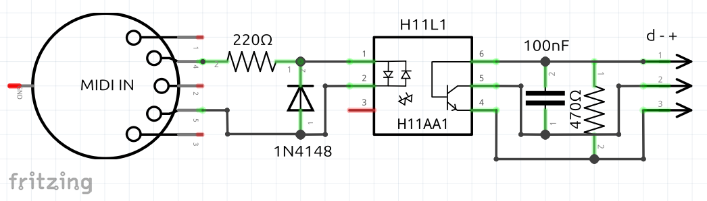

# MidiModule

### Simple 3.3V Breadboard MIDI Input Module

Designed in [Fritzing](https://fritzing.org) for use with Raspberry Pi and other 3.3V microcontrollers.

* **Fritzing Source:** `MidiModule.fzz`
* **Gerber Files:** Included in the attached `.zip` file for direct upload to PCB manufacturers (e.g., JLCPCB).

## Parts
* 1× 470Ω resistor     (R2)
* 1× 220Ω resistor     (R1)
* 1× 1N4148 diode      (D1)
* 1× 100nF capacitor   (C1)
* 1× H11L1 optocoupler (IC), optional 1x 6 pin IC socket. 
* 1× MIDI DIN connector
* 3× Header pins

## Breadboard

## Schematic

## PCB

> [!NOTE]
> Keep in mind that MIDI DIN socket footprint specs vary by manufacturer. I had to drill out the PCB mounting holes to 1 mm to fit my component. Additionally, the two front support pins are wider on some socket variants so look to find the narrow version.

## Prototype

## Credit
The circuit was based on this MiniDexed project from Kevin
* https://diyelectromusic.com/2025/09/27/minidexed-raspberry-pi-io-board-v2-build-guide
