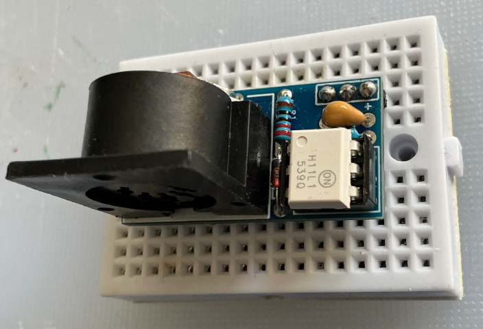
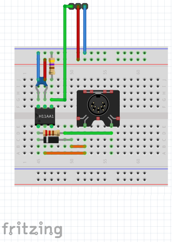
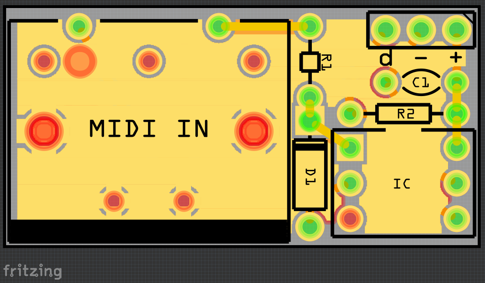

# MidiModule

### Simple 3.3V Breadboard MIDI Input Module

Designed in [Fritzing](https://fritzing.org) for use with Raspberry Pi and other 3.3V microcontrollers.

* **Fritzing Source:** `MidiModule.fzz`
* **Gerber Files:** Included in the attached `.zip` file for direct upload to PCB manufacturers (e.g., JLCPCB).

## Parts
* 1× 470Ω resistor
* 1× 220Ω resistor
* 1× 1N4148 diode
* 1× 100nF capacitor
* 1× H11L1 optocoupler
* 1× MIDI DIN connector
* 3× Header pins

## Prototype

## Breadboard

## PCB

## Credit
This circuit was based on this MiniDexed project from Kevin
  - https://diyelectromusic.com/2025/09/27/minidexed-raspberry-pi-io-board-v2-build-guide
